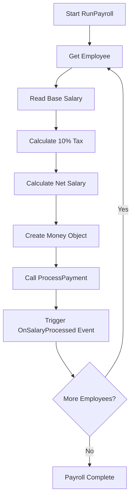

# Payroll Processing Flow

```mermaid
flowchart TD
    A[Start RunPayroll] --> B[Get Employee]
    B --> C[Read Base Salary]
    C --> D[Calculate 10% Tax]
    D --> E[Calculate Net Salary]
    E --> F[Create Money Object]
    F --> G[Call ProcessPayment]
    G --> H[Trigger OnSalaryProcessed Event]
    H --> I{More Employees?}

    I -->|Yes| B
    I -->|No| J[Payroll Complete]
```