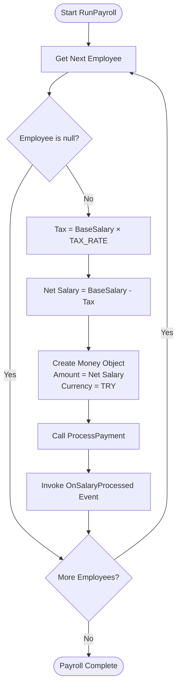

# Payroll Processing Flow

```mermaid
flowchart TD
    A([Start RunPayroll]) --> B[Get Next Employee]

    B --> C{Employee is null?}

    C -->|Yes| I{More Employees?}
    C -->|No| D[Tax = BaseSalary × TAX_RATE]

    D --> E[Net Salary = BaseSalary - Tax]
    E --> F[Create Money Object<br/>Amount = Net Salary<br/>Currency = TRY]
    F --> G[Call ProcessPayment]
    G --> H[Invoke OnSalaryProcessed Event]

    H --> I{More Employees?}

    I -->|Yes| B
    I -->|No| J([Payroll Complete])
```