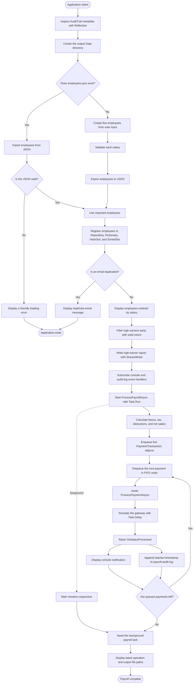

# PayrollSystem V2 Runtime Flow

This flow shows application startup, employee persistence and validation, reporting, background payroll processing, and event-driven audit logging.

```mermaid
flowchart TD
    A([Application starts]) --> B[Inspect AuditTrail metadata with Reflection]
    B --> C[Create the output Data directory]
    C --> D{Does employees.json exist?}

    D -->|Yes| E[Import employees from JSON]
    E --> F{Is the JSON valid?}
    F -->|No| G[Display a friendly loading error]
    G --> Z([Application ends])
    F -->|Yes| K[Use imported employees]

    D -->|No| H[Create five employees from user input]
    H --> I[Validate each salary]
    I --> J[Export employees to JSON]
    J --> K

    K --> L[Register employees in Repository, Dictionary, HashSet, and SortedSet]
    L --> M{Is an email duplicated?}
    M -->|Yes| N[Display duplicate-email message]
    N --> Z
    M -->|No| O[Display employees ordered by salary]

    O --> P[Filter high earners lazily with yield return]
    P --> Q[Write high-earner report with StreamWriter]
    Q --> R[Subscribe console and audit-log event handlers]

    R --> S[Start ProcessPayrollAsync with Task.Run]
    S -. foreground .-> T[Main remains responsive]
    T --> U[Await the background payroll task]

    S --> V[Calculate bonus, tax, deductions, and net salary]
    V --> W[Enqueue five PaymentTransaction objects]
    W --> X[Dequeue the next payment in FIFO order]
    X --> Y[Await ProcessPaymentAsync]
    Y --> AA[Simulate the gateway with Task.Delay]
    AA --> AB[Raise OnSalaryProcessed]

    AB --> AC[Display console notification]
    AB --> AD[Append Istanbul timestamp to payroll-audit.log]
    AC --> AE{Are queued payments left?}
    AD --> AE

    AE -->|Yes| X
    AE -->|No| U
    U --> AF[Display latest operation and output file paths]
    AF --> AG([Payroll complete])
```
