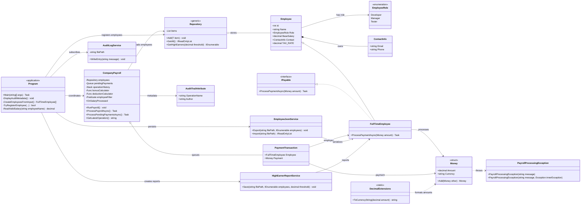

# PayrollSystem V2 Architecture

The Core project contains the payroll domain, collections, persistence services, reporting, metadata, and asynchronous payment workflow. The App project provides startup configuration and console interaction.

